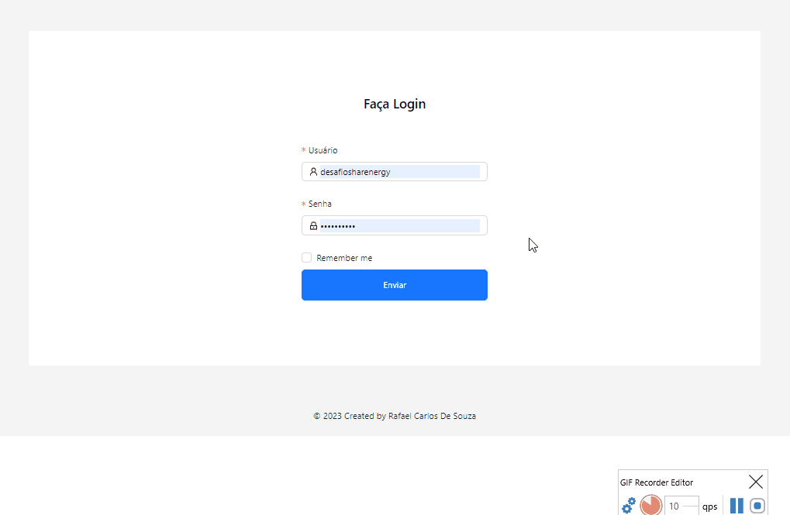

# Projeto FullStack

## _Aplicação desenvolvida com JavaScript e utilizando o TypeScript para maior auxilio_


## Objetivo ?

* Construir uma aplicação completa com backend e frontend baseada em JavaScript e Node
* Integrações com outras Apis externas
* Tratamento de imagens em Base64
* CRUD completo
* Testar conhecimento de desenvolvimento e habilidade de resolver problemas
* Utilizar um banco de remoto


### **Frontend desenvolvido** com:
[ReactJS],
[AntD],
[Styled-Components]
[TypeScript]
[CSS]

### **Backend desenvolvido** com:
[NodeJs]
[TypeScript]
[Express]
[PrismaORM]
[MongoDB][Nuvem]
## **Instalação**

Requer [Node.js](https://nodejs.org/) instalado em sua maquina

Ao acessar ser terminal (cmd,bash, powerShell, etc.. )
siga os seguintes comandos :

```sh
git clone https://github.com/RafaelCss/desafio-sharenergy-2023-01.git
cd desafio-sharenergy-2023-01
para da start no backend : cd backend / npm run dev
para da start no frontend : cd ..  / cd frontend  / npm run start
```

* Para haver conexão com banco de dados, você deve entra no diretório backend e no arquivo .env nesta variável : **DATABASE_URL** adicione a sua string de conexão do MongoDbAtlas


* Site cadastro do [MongoDb ](https://account.mongodb.com/account/login?n=%2Fv2%2F62d5f0a7c3531c6b64ad7ff7&nextHash=%23clusters)


# _Algumas visualizações :_



